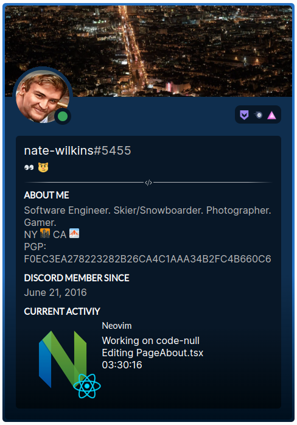

# react-discord-presence

[](https://www.npmjs.org/package/react-discord-presence)
[](https://github.com/Nate-Wilkins/react-discord-presence/issues)
[](https://github.com/Nate-Wilkins/react-discord-presence/blob/main/LICENSE)

> Display your Discord presence in react.

```
yarn add react-discord-presence
```

## Example

[](https://stackblitz.com/edit/react-ts-nfdx3w?file=App.tsx)

Check it out on [StackBlitz](https://stackblitz.com/edit/react-ts-nfdx3w?file=App.tsx).

## Usage

There are three forms of Discord presence. (iframe, react, and custom)

For fine grained control see [docs/Customization.md](./docs/Customization.md).

### iframe

```
TODO:
```

### React

In `react` with CSS modules:

```typescript
import { DiscordPresence } from 'react-discord-presence';
import discordPresenceClasses from 'react-discord-presence/dist/src/display/style/DiscordPresenceDefault.module.css';
// ...
<DiscordPresence
  classes={Object.assign({}, discordPresenceClasses, discordPresenceCodeClasses}}
  args={{ developerId: "<your-developer-id>" }}
/>
```

## Development

Written in typescript. Workflows are defined in `.envrc.sh`.

## External Resources

- [Schema Lanyard API Discord Presence](https://github.com/Nate-Wilkins/schema-lanyard-discord-presence)
- [Lanyard API](https://github.com/Phineas/lanyard): REST and WS API that provides Discord presence data.
- [Discord CDN Alternative](https://gist.github.com/dustinrouillard/04be36180ed80db144a4857408478854): REST API the
  provides Discord presence data.

## Roadmap

### Display

- <iframe src="data:text/html;charset=utf-8;base64,PGh0bWw+DQogIDxwPkhlbGxvIHdvcmxkPzwvcD4NCjwvaHRtbD4=" />
  https://dopiaza.org/tools/datauri/index.php
- Support code splitting.
- Support for light theme.
- Support for screencapture of storybook components.
- Support for failing image downloads/errors.
- Support for Spotify.
- Support for overflow in activities & activity details? Should this be a custom scrollbar?
- Add tails to hover popovers.
- Flatten CSS and image assets in distributable.

### Accessor

- Support for realtime presence data with the web socket API.
- Support for automated queries on an interval.
- Support for custom `maxDelay` on call site.
