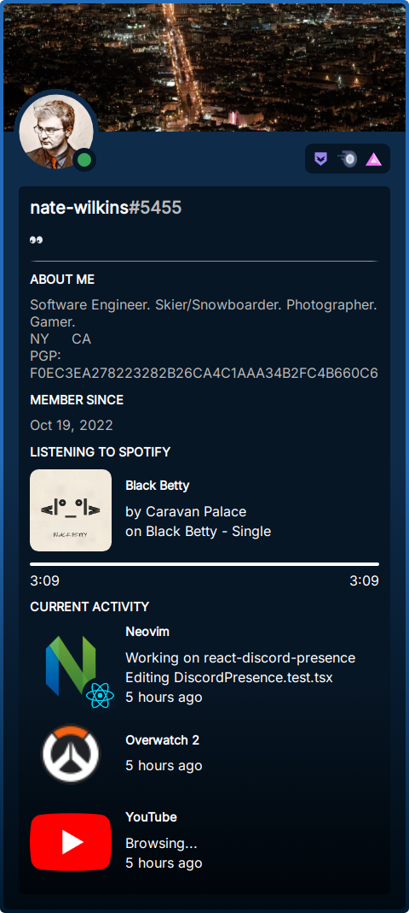
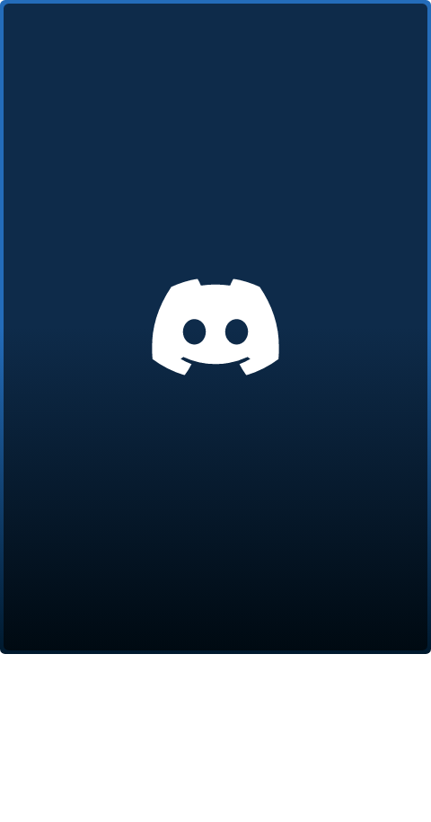
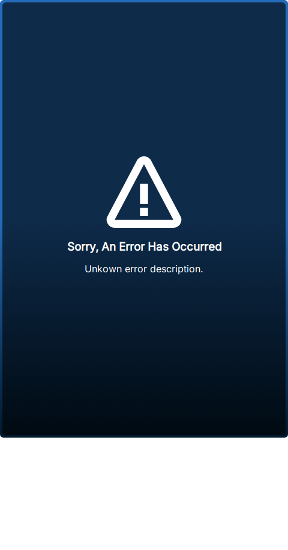

[//]: # "!!!!!!!!!!!!!!!!!!!!!!!!!!!!!!!!!!!!!!!!!!!!!!!!!"
[//]: # "!!!!!!                                     !!!!!!"
[//]: # "!!!!!!      >>>>> WARNING <<<<<            !!!!!!"
[//]: # "!!!!!!                                     !!!!!!"
[//]: # "!!!!!! This file is autogenerated.         !!!!!!"
[//]: # "!!!!!!                                     !!!!!!"
[//]: # "!!!!!!      >>>>> WARNING <<<<<            !!!!!!"
[//]: # "!!!!!!                                     !!!!!!"
[//]: # "!!!!!!!!!!!!!!!!!!!!!!!!!!!!!!!!!!!!!!!!!!!!!!!!!"

# react-discord-presence

[](https://www.npmjs.org/package/react-discord-presence)
[](https://github.com/Nate-Wilkins/react-discord-presence/issues)
[](https://github.com/Nate-Wilkins/react-discord-presence/blob/main/LICENSE)

> Display your Discord presence.

```
yarn add react-discord-presence
```

## Example

Check it out on [StackBlitz](https://stackblitz.com/edit/react-ts-nfdx3w?file=App.tsx).

[](https://stackblitz.com/edit/react-ts-nfdx3w?file=App.tsx)

__Loading State__

[](https://stackblitz.com/edit/react-ts-nfdx3w?file=App.tsx)

__Error State__

[](https://stackblitz.com/edit/react-ts-nfdx3w?file=App.tsx)

You can find more examples in [`docs/Examples.md`](./docs/Examples.md).

## Features

- Self Contained
- Banner
- Avatar
- User Online Status
- User Status
- Emojis
- Badges (Boost badge will match `premium_since`)
- About Me
- Member Since (Mostly, icons are on the Roadmap)
- Spotify
- Activity
- Customization

Please note that this component is only possible by the [Lanyard API](https://github.com/Phineas/lanyard) and the work done to get the correct data
pulled into the display components.

## Requirements

This solution uses the [Lanyard API](https://github.com/Phineas/lanyard) which will require the Discord user your
displaying presence for to be in the [Lanyard API Discord](https://discord.gg/UrXF2cfJ7F). You will also have to have
"Developer Mode" on for the user.

If they're not in the Discord server, you'll get a response error from their API.

## Usage

You can use the self contained `DiscordPresence` component which will handle
data retrieval, loading, error, and display states automatically for you.

```
<style>
@import url('https://fonts.googleapis.com/css2?family=Inter&display=swap');
</style>
```

### React

```typescript
import { DiscordPresence } from 'react-discord-presence';

// ...
<DiscordPresence args={{ developerId: "<your-developer-id>" }} />
```

### Custom

For fine grained control see [`docs/Customization.md`](./docs/Customization.md).

## Development

Written in Typescript. Workflows are defined in `.envrc.sh`.

## External Resources

- [Schema Lanyard API Discord Presence](https://github.com/Nate-Wilkins/schema-lanyard-discord-presence): Schema for the
  Lanyard API.
- [Lanyard API](https://github.com/Phineas/lanyard): REST and WS API that provides Discord presence data.
- [Discord CDN Alternative](https://gist.github.com/dustinrouillard/04be36180ed80db144a4857408478854): REST API that
  provides Discord presence data.

## Roadmap

- "iframe" embed
  - https://github.com/nwtgck/gh-card
  - https://legacy.reactjs.org/docs/react-dom-server.html
  - https://razzlejs.org/getting-started

### Display

- Update `memberSince` to use `(developerId / 4194304 + 1420070400000) / 1000`.
- Modify Twemoji to use `ErrorImage` when the emoji image errors.
- Support for overflow in activities & activity details? Should this be a custom scrollbar?
- Find SVG badges for 'TeamPseudoUser', 'VerifiedBot', 'CertifiedModerator', 'BotHTTPInteractions', 'Spammer', and 'Quarantined'

### Data

- Support for realtime presence data with the web socket API.
- Support for automated queries on an interval.
- Support for custom `maxDelay` on call site.

### Build

- Flatten asset distributable output (CSS/Images/etc)

## Contributions

| Author  | Estimated Hours |
| ------------- | ------------- |
| [](https://github.com/nate-wilkins) | <p align="right">33.52 Hours</p> |
| [![dependabot[bot]](https://github.com/dependabot[bot].png?size=64)](https://github.com/dependabot[bot]) | <p align="right">0.52 Hours</p> |